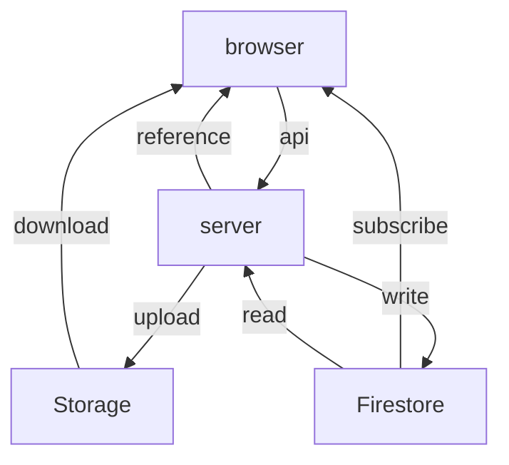

# Hinagiku

Hinagiku (雛菊), or Daisy in English, is an intelligent system designed to support discussions in educational environments. One of Hinagiku's key features is its real-time voice transcription and analysis, which helps hosts provide timely and insightful feedback, setting it apart from other educational tools. We chose the name Hinagiku because it reflects our core values: resilience, simplicity, and growth—much like the daisy flower itself, which flourishes in diverse conditions. Our mission is to help participants and hosts connect meaningfully by providing tools that facilitate better communication and collaboration in classrooms.

## Key Technologies

- **SvelteKit** for the front-end framework
- **Firebase** (Firestore and Auth) on Google Cloud Platform
- **Object storage** via Google Cloud Storage or Cloudflare R2
- **LLM** via Genkit for language understanding and generation, with support for Google, OpenAI, and others

For deployment-specific settings such as custom colors or titles, see [`DEPLOYMENT-CONFIG.md`](DEPLOYMENT-CONFIG.md).

### Multi-provider Support

Hinagiku can run against different storage and AI providers. Set the `HINAGIKU_STORAGE_BACKEND` environment variable to `firebase` or `r2` to choose between Google Cloud Storage and Cloudflare R2. Language model providers are configured in [`src/lib/ai/index.ts`](src/lib/ai/index.ts), allowing you to swap OpenAI for Google Gemini or other Genkit-compatible models.

## Development Instructions

To set up the development environment for Hinagiku, please follow these steps:

### Install dependencies

Ensure you have **Node.js 20+** and `pnpm` installed. If not, you can install pnpm using the script:

```sh
curl -fsSL https://get.pnpm.io/install.sh | sh -
```

> See <https://pnpm.io/installation> for more details

Then, install the project dependencies:

```sh
pnpm install
```

### Set up environment variables and files

Create a `.env` file in the root directory of the project and copy the contents from `.env.example`:

```sh
cp .env.example .env
```

Ensure the environment variables are correctly set in the `.env` file.

Ensure that the `GOOGLE_APPLICATION_CREDENTIALS` file exists in the root directory of the project. This file is necessary for Firebase Admin SDK to authenticate.

By following these steps, you will be able to set up and run the Hinagiku project locally for development purposes.

### Setup Firebase

To set up indexes and security rules for Firestore, run the following command:

```sh
FIREBASE_PROJECT_ID=your-project-id pnpm firebase:deploy
```

Also, ensure that both the Email/Password and Google sign-in methods are enabled in the Firebase console under Authentication > Sign-in method.

### Run the development server

Start the development server using the following command:

```sh
pnpm dev
```

### Lint and format the code

Ensure your code adheres to the project's linting and formatting rules:

```sh
pnpm lint
pnpm format
```

### Run tests

Execute the vitest suite to verify that everything works as expected:

```sh
pnpm test
```

## Data Flow

We have four main components in the system: the browser, the server, Firestore, and object storage (Cloud Storage or Cloudflare R2).

- **Firestore and storage** are read-only for the browser. The difference is that Firestore is used on a push (subscribe) basis, while the storage backend is used on a pull (download) basis.
- The **server** is the only component that can write to Firestore and storage. The browser must communicate through the server to perform any write operations.



This data flow allows us to control data updates centrally while still leveraging Firestore's security rules and real-time capabilities for read operations.

## Data Model

The front-end data model between the browser and Firestore is straightforward. We aim to map application routes directly to Firestore document paths. This approach allows us to easily subscribe to the appropriate documents and collections in Firestore, optimizing the number of read operations since the front-end views only one document or collection at a time.

## Contributing

We welcome contributions! If you are new here:

- Fork the repository and create your feature branch from `main`.
- Use `pnpm lint` and `pnpm test` to ensure your changes pass formatting and tests.
- Open a pull request describing your changes.

This project is released under the [MIT License](LICENSE).
