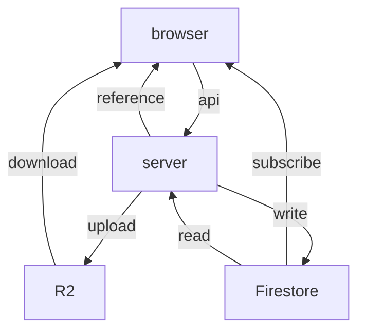

# Hinagiku

Hinagiku (雛菊), or Daisy in English, is an intelligent system designed to support discussions in educational environments. One of Hinagiku's key features is its real-time voice transcription and analysis, which helps hosts provide timely and insightful feedback, setting it apart from other educational tools. We chose the name Hinagiku because it reflects our core values: resilience, simplicity, and growth—much like the daisy flower itself, which flourishes in diverse conditions. Our mission is to help participants and hosts connect meaningfully by providing tools that facilitate better communication and collaboration in classrooms.

## Development Instructions

To set up the development environment for Hinagiku, please follow these steps:

### Install dependencies

Ensure you have `pnpm` installed. If not, you can install it using the script:

```sh
curl -fsSL https://get.pnpm.io/install.sh | sh -
```

> See <https://pnpm.io/installation> for more details

Then, install the project dependencies:

```sh
pnpm install
```

### Set up environment variables and files

Create a `.env` file in the root directory of the project and copy the contents from `.env.example`:

```sh
cp .env.example .env
```

Ensure the environment variables are correctly set in the `.env` file.

Ensure that the `GOOGLE_APPLICATION_CREDENTIALS` file exists in the root directory of the project. This file is necessary for Firebase Admin SDK to authenticate.

By following these steps, you will be able to set up and run the Hinagiku project locally for development purposes.

### Run the development server

Start the development server using the following command:

```sh
pnpm dev
```

### Lint and format the code

Ensure your code adheres to the project's linting and formatting rules:

```sh
pnpm lint
pnpm format
```

## Data Flow

We have four main components in the system: the browser, the server, Firestore, and R2 (S3-compatible storage).

- **Firestore and R2** are read-only for the browser. The difference is that Firestore is used on a push (subscribe) basis, while R2 is used on a pull (download) basis.
- The **server** is the only component that can write to Firestore and R2. The browser must communicate through the server to perform any write operations.



This data flow allows us to control data updates centrally while still leveraging Firestore's security rules and real-time capabilities for read operations.

## Data Model

The front-end data model between the browser and Firestore is straightforward. We aim to map application routes directly to Firestore document paths. This approach allows us to easily subscribe to the appropriate documents and collections in Firestore, optimizing the number of read operations since the front-end views only one document or collection at a time.
